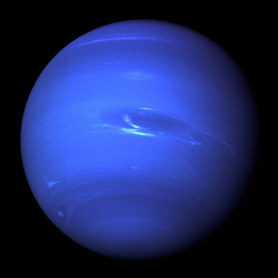
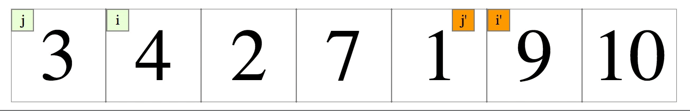
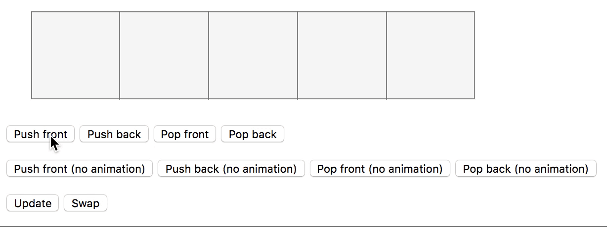
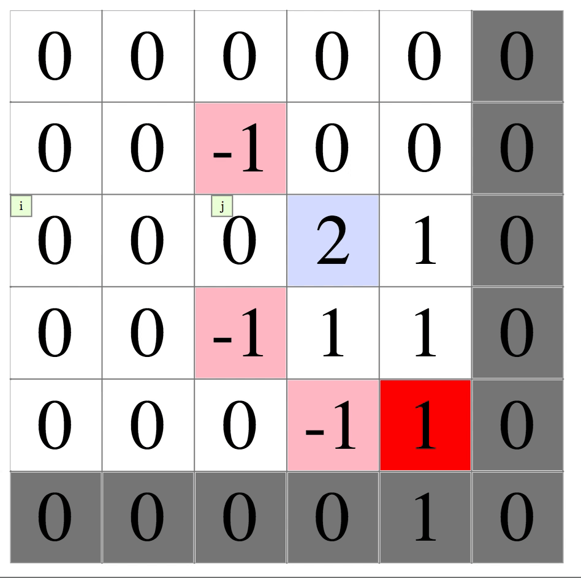
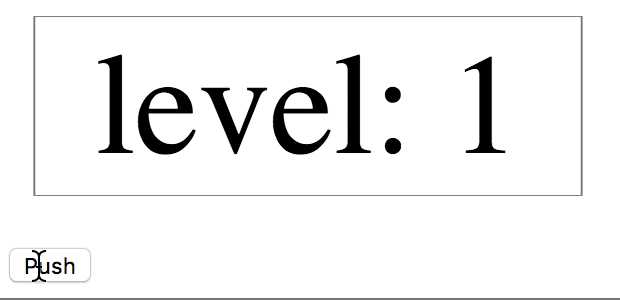

# cf-neptune



Algorithm visualization tool, runs in browser.


## Examples
Note that cf-neptune is compiled into ES5, thus supports all major browsers, but the [examples](./examples) are written in ES6, you may need a modern browser to run examples properly.

To run examples:
* Navigate to the root folder
* `yarn` installs dependencies
* `yarn build` builds the project
* Go to `examples` folder, you can run individual example by opening an example file

## Screenshots of Some Examples

### Bubble Sort



### Push n Pop



### Matrix Traversal



### Nested Elements



# Tutorial (WIP)

## Mounting an Atom: a Hello World app

One of the most important element of cf-neptune is **Atom**, which corresponds to the `nep.Atom` class, it offers scaling, coloring, children management support, etc (we'll cover these in the following sections). For now, we simply use a `nep.Atom` to display a text.

```js
const textElement = new nep.Atom({width: 300, height: 100}, 'Hello World');
```

To display an element, we need to mount the element to a playground, first, we need a DOM element:

```html
<div id="playground"></div>
```

Then, call `nep.newPlayground` to mount the element we created:

```js
nep.newPlayground(root, textElement);
```

----------
**WIP**
