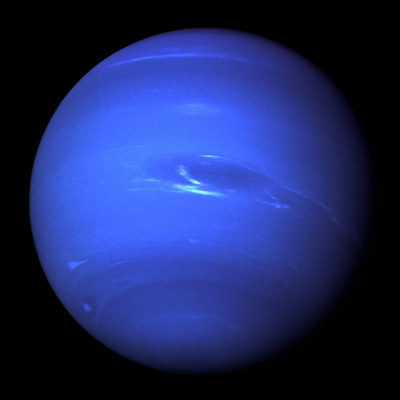

# cf-neptune

Algorithm visualization tool, runs in browser.

## Examples
cf-neptune is compiled into ES5, supporting all major browsers, but the [examples](./examples) are written in ES6 JavaScript directly, so you may need a modern browser to run example pages correctly.
